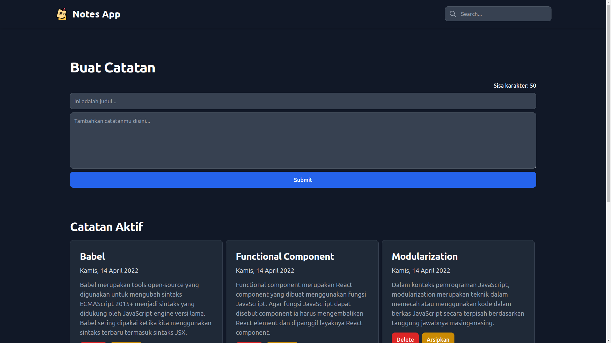
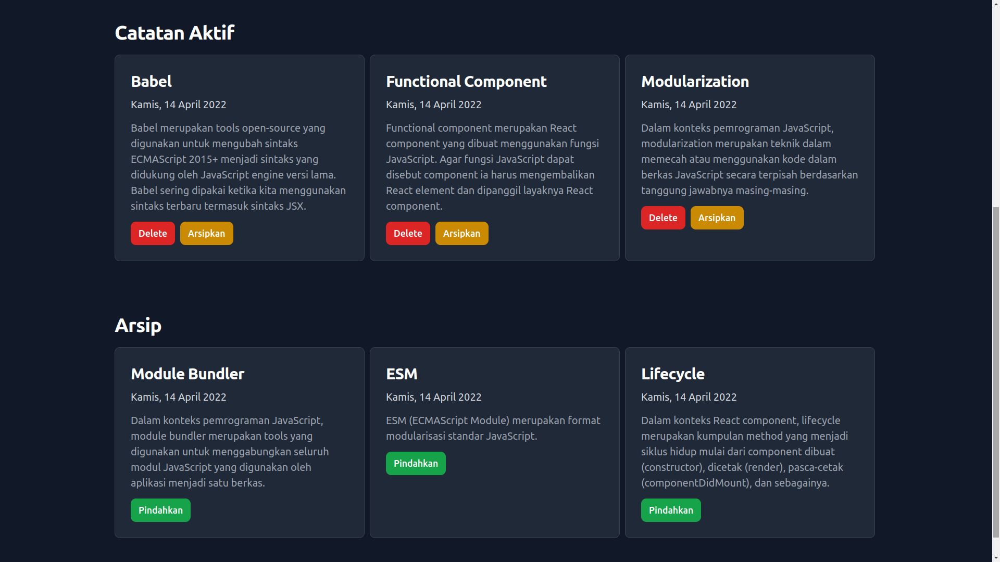

# Notes App With React

A simple notes app built with Vite + React + TailwindCSS

## Features

- Add new notes
- Delete notes
- Archive notes
- Search notes by title

## Getting Started

### Prerequisites

- Node.js and npm installed.

### Installation

1. Clone the repository:
    ```bash
    git clone https://github.com/HuseinHQ/notes-app-react.git
    ```
2. Install depedencies:
    ```bash
    npm install
    ```
3. Run the code
    ```bash
    npm run dev
    ```

## Screenshots
### Upper page view


### Lower Page view



